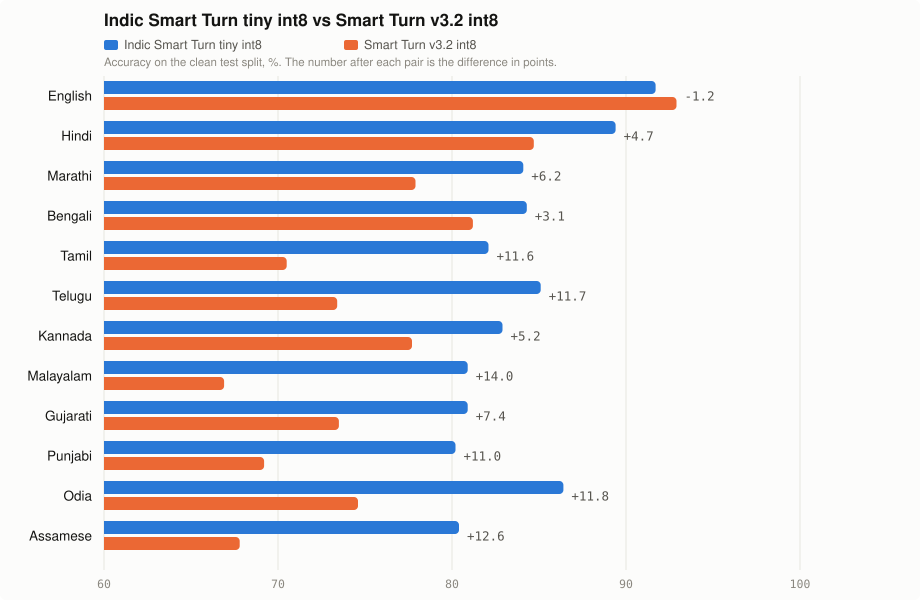
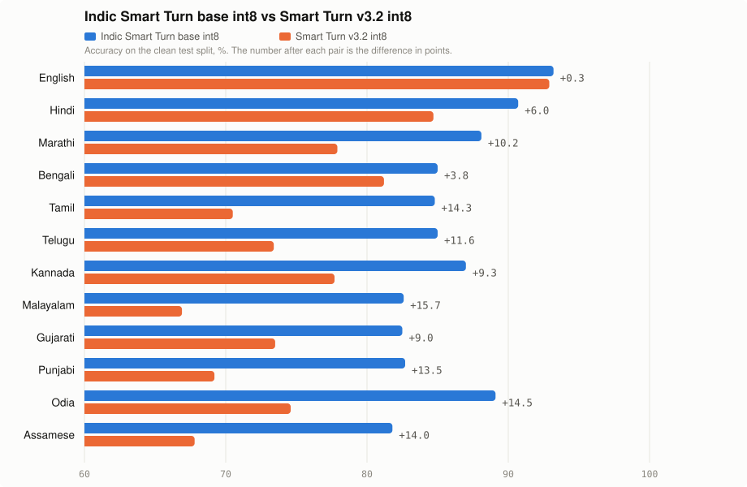
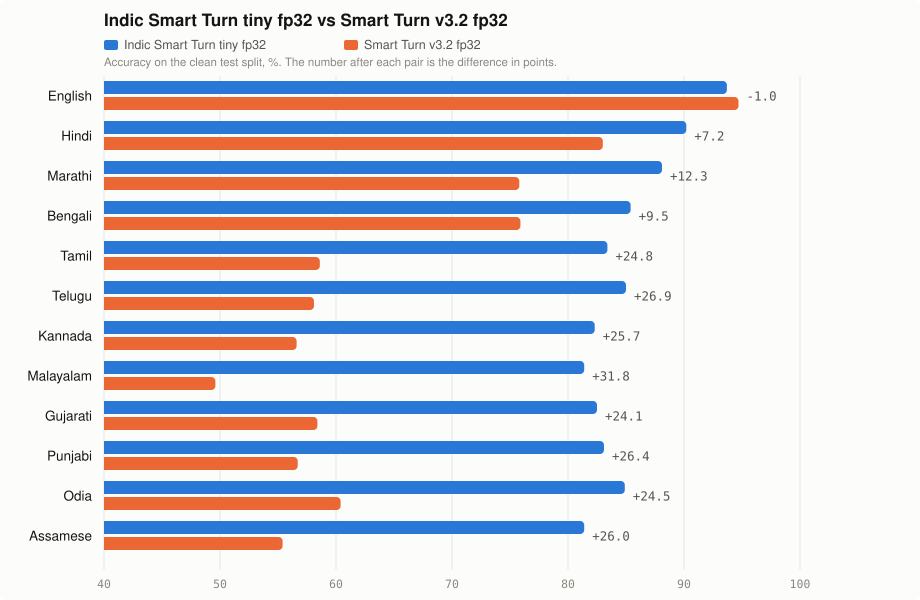
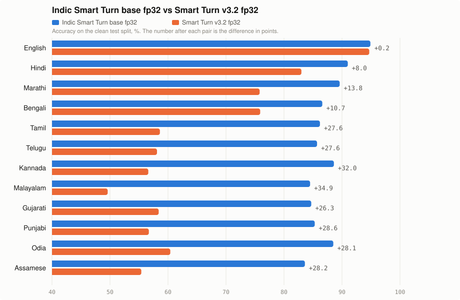

# Indic Smart Turn

A voice agent has to decide, every time the user pauses, whether they have finished speaking or are only taking a breath. Get it wrong one way and the agent interrupts; get it wrong the other way and it sits in silence. Indic Smart Turn makes that decision from the audio itself, for Indic-language conversations (and English), and runs on a single CPU core in under 50 ms.

It is built with the [Pipecat Smart Turn v3](https://github.com/pipecat-ai/smart-turn) recipe, not from its weights. The encoder starts from OpenAI's Whisper (base or tiny), the decoder is dropped, Smart Turn's attention-pooling head is added, and the whole network is trained on 8-second complete-or-incomplete clips: about 52,000 from real Indian phone conversations, plus Pipecat's own data so English stays in the mix. Smart Turn v3.2 appears here only as the model we compare against. The result loads in Pipecat's `LocalSmartTurnAnalyzerV3` with a one-line change, and in LiveKit through the same adapter.

**Why this model**

- **Covers the languages Smart Turn v3.2 does not.** Tamil, Telugu, Kannada, Malayalam, Gujarati, Punjabi, Odia and Assamese are absent from v3.2. Hindi, Marathi and Bengali are present there but were trained mostly on synthetic speech.
- **Trained on real speech.** The Indian-language training clips are real two-person phone conversations recorded by AI4Bharat for IndicVoices, not synthetic TTS. Labels come from an audio model listening to each clip, with a text model as a second opinion.
- **Measured against the same test clips as Smart Turn v3.2.** Ahead by 3 to 14 points at the same model size, and by 6 to 18 points with the larger encoder. On the human-validated [TamilEOT](https://arxiv.org/abs/2609.05631) benchmark it matches the published whisper-base result.
- **One file for all languages.** No per-language switching, and English is kept.

Models: [adimyth/indic-smart-turn](https://huggingface.co/adimyth/indic-smart-turn). Data: [adimyth/indic-smart-turn-data](https://huggingface.co/datasets/adimyth/indic-smart-turn-data).

## Motivation

Smart Turn listens to the user's raw audio and decides whether they have finished speaking or are pausing mid-thought. A fixed silence timeout forces you to choose between slow responses and interruptions; Smart Turn removes that trade-off. Smart Turn Analyser v3.2 supports 23 languages. Among Indian languages it covers Hindi, Marathi and Bengali, trained on data that is about 82% synthetic TTS. On real Tamil phone calls it scores 70% zero-shot ([TamilEOT](https://arxiv.org/abs/2609.05631)). South Indian languages, Gujarati and Punjabi are missing.

This project trains one Indic-focused model so a voice agent serving Indian users loads a single checkpoint instead of per-language files, and keeps English.

## Data sources

| Source | License | What it contributes |
|---|---|---|
| [ai4bharat/IndicVoices](https://huggingface.co/datasets/ai4bharat/IndicVoices) | CC BY 4.0 | Real two-party phone conversations, one speaker per recording, split into transcript segments with human transcripts. We use the `Conversation` rows only. |
| [santhosh-005/tamil-eot](https://huggingface.co/datasets/santhosh-005/tamil-eot) | CC BY 4.0 | 18,485 human-validated turn boundaries from 116 Tamil calls (SPRING-INX), pre-cut as 8 s clips. |
| [pipecat-ai/smart-turn-data-v3.2](https://huggingface.co/datasets/pipecat-ai/smart-turn-data-v3.2-train) | CC BY 4.0 | The upstream training mix (mostly TTS) for English, Hindi and Marathi, so the model keeps English and the languages Smart Turn Analyser v3.2 already covers. |

> [!NOTE]
> IndicVoices weighs 30 to 50 GB per language, and only about 17% of it is conversational. `indic_turn/scan.py` reads the metadata columns of each parquet shard over HTTP with pyarrow column projection and picks the conversational rows. `indic_turn/build.py` then downloads only the shards that hold labelled rows, about 2 to 3 GB per language.

## How labels are generated

IndicVoices cuts segments at pauses, not at turn ends, so a segment end does not imply a turn end. Every built clip carries two labels.

### Audio label

`gemini-3.7-flash` hears one clip: the last 8 seconds of audio, ending where the speaker paused. We send the transcript of that clip when we have one, and the audio alone when we do not. Gemini answers complete or incomplete, with a confidence and a one-line reason.

The speaker paused after "market":

```
Audio:      last 8 s, ending at the pause
Transcript: I was going to the market
```

```json
{
    "verdict": "incomplete", 
    "confidence": 0.9, 
    "reason": "sentence still open"
}
```

Labelling cost about $29.

### Text label

`gpt-6-luna` (`gpt-5.4` for Hindi and Telugu) gets one speaker's whole session in a single request. Every pause-split segment is one line, `[chunk] (duration) text`. We ask whether the speaker had finished at the end of each line. The model returns `1` (complete) or `0` (incomplete) and a confidence for every line. It uses the later lines to decide the earlier ones.

```
[1] (2.1s) I was going to the market
[2] (1.4s) to buy milk
[3] (0.8s) okay thanks
```

```json
{"labels": [[1, 0, 0.9], [2, 1, 0.9], [3, 1, 1.0]]}
```

Line 1 is incomplete because line 2 finishes the sentence. Line 2 is complete. Line 3 is complete because it is a short acknowledgement.

On a 600-clip validation run the text labels agreed with the audio label 89–90% of the time with matching complete rates; the disagreements are mostly prosody the text cannot see. Test clips where the two disagree are reported separately as "ambiguous".

Labelling cost about $6.50.

### Pause-cuts

Extra incomplete examples come from cutting a segment at an internal pause ("pause-cut"), the spot where a VAD fires mid-turn in production. The full segment below pauses after "market". We send Gemini only the audio up to that pause, with no transcript.

```
Full segment: I was going to the market [pause] to buy milk
Audio sent:   I was going to the market [pause]
Transcript:   none
```

Only about half of such cuts sound incomplete when heard, so a pause-cut is kept only when the audio label says incomplete. Segments shorter than 1.5 s, almost all one-word acknowledgements, are capped at 20% of each language so they do not crowd out the hard mid-length cases.

## Languages

English plus eleven Indian languages. The built Indic set is 50,421 samples: [adimyth/indic-smart-turn-data](https://huggingface.co/datasets/adimyth/indic-smart-turn-data). English is a capped sample of Pipecat v3.2 and is not in these tables. Hindi, Marathi and Bengali add that same Pipecat mix on top of IndicVoices, and Tamil adds TamilEOT.

Ambiguous clips were taken out of test because the text label and the audio label disagree.

| Language | Samples | Train | Dev | Test | Ambiguous |
|---|---:|---:|---:|---:|---:|
| Hindi | 4,864 | 3,837 | 527 | 460 | 40 |
| Marathi | 4,747 | 3,638 | 521 | 537 | 51 |
| Tamil | 2,616 | 2,071 | 226 | 300 | 19 |
| Kannada | 4,005 | 3,224 | 371 | 385 | 25 |
| Malayalam | 4,714 | 3,845 | 376 | 472 | 21 |
| Gujarati | 4,907 | 4,007 | 368 | 498 | 34 |
| Punjabi | 4,808 | 3,843 | 366 | 556 | 43 |
| Telugu | 5,167 | 3,776 | 598 | 725 | 68 |
| Assamese | 4,770 | 3,690 | 388 | 639 | 53 |
| Odia | 4,455 | 3,854 | 248 | 331 | 22 |
| Bengali | 5,368 | 4,140 | 717 | 482 | 29 |

Complete is the share of clips labelled as a finished turn.

| Language | Complete | Text vs audio agreement |
|---|---:|---:|
| Hindi | 70.3% | 90.9% |
| Marathi | 67.5% | 89.5% |
| Tamil | 75.2% | 93.3% |
| Kannada | 74.6% | 90.7% |
| Malayalam | 70.6% | 93.3% |
| Gujarati | 67.7% | 92.0% |
| Punjabi | 67.5% | 91.2% |
| Telugu | 70.8% | 90.4% |
| Assamese | 69.6% | 89.1% |
| Odia | 72.3% | 89.3% |
| Bengali | 69.6% | 92.0% |

## How the model was trained

### Machine

One RunPod on-demand pod

| | |
|---|---|
| GPU | NVIDIA RTX A6000, 48 GB |
| CPU | AMD EPYC 7543, 96 vCPU |
| RAM | 503 GB |
| Storage | 140 GB |
| Image | `runpod/pytorch:1.0.2-cu1281-torch280-ubuntu2404` |
| Price | $0.53 per hour |
| Packages | torch 2.8.0+cu128, transformers 4.48.2, datasets 4.4.1, torchcodec 0.7.0, onnxruntime 1.30.0 |

The GPU is not the bottleneck: training is bound by audio decoding on the CPU, which is why the pod with 96 vCPUs was chosen over cheaper cards with fewer cores.

### Data mix per epoch

| Source | Samples | Notes |
|---|---|---|
| IndicVoices, 11 languages, train split | 51,917 x 2 | audio-labelled clips, oversampled twice |
| TamilEOT train | included in the row above | real Tamil calls, human-validated |
| Pipecat v3.2 English | 40,000 | capped random sample |
| Pipecat v3.2 Hindi, Marathi, Bengali | 26,427 | all rows |
| **Total per epoch** | **166,939** | |

In-training evaluation uses 10,031 samples: the Indic dev splits, the TamilEOT dev split and 3,000 rows of the v3.2 test set. The held-out Indic test splits are never seen during training.

### Recipe

`train/train.py` is the upstream Pipecat trainer with a different data loader. Both models share the recipe:

| | |
|---|---|
| Encoder | `openai/whisper-base` (20M params) and `openai/whisper-tiny` (8M), decoder discarded, attention pooling + MLP head as upstream |
| Input | last 8 s of 16 kHz audio as 80-bin log-mel, 800 frames |
| Loss | BCE with per-batch positive weighting |
| Optimiser | AdamW, lr 5e-5, weight decay 0.01, cosine schedule, warmup 20% |
| Batch | 128, bf16, 4 epochs, 5,216 steps |
| Checkpoint | best in-training eval F1 |
| Wall time | base 18.7 min, tiny 24.0 min (594 and 460 samples per second) |

> [!NOTE]
> The fp32 ONNX uses the legacy TorchScript exporter at opset 18 with constant folding on. Folding has to stay on, or int8 quantisation leaves the file at fp32 size. The tiny model uses static int8 (QDQ, per-channel, MinMax calibration on 1,024 training samples): 32 MB to 8.7 MB. The base model uses dynamic int8 (weights only, no calibration): 81 MB to 24 MB, because static calibration cost it 4 to 9 points of accuracy while dynamic kept ROC-AUC unchanged. `scripts/reexport.py` repeats export and quantisation from a saved checkpoint.

### Reproducing

```bash
# Create the RunPod pod and write its SSH endpoint to .pod_ssh.
uv run python scripts/pod_create.py

# Copy the repo to the pod, then install dependencies and download the upstream datasets.
scripts/pod_sync.sh
scripts/pod_ssh.sh "cd /workspace/indic-turn && bash scripts/pod_setup.sh"

# Train whisper-base, then whisper-tiny. Each run builds, trains, and quantises in the background.
scripts/pod_ssh.sh "cd /workspace/indic-turn && BASE_MODEL=openai/whisper-base nohup bash scripts/pod_pipeline.sh indic-base > logs/pipeline_indic-base.log 2>&1 &"
scripts/pod_ssh.sh "cd /workspace/indic-turn && BASE_MODEL=openai/whisper-tiny nohup bash scripts/pod_pipeline.sh indic-tiny > logs/pipeline_indic-tiny.log 2>&1 &"

# After both runs finish, score every model on the held-out test split and the ambiguous split.
scripts/pod_ssh.sh "cd /workspace/indic-turn && nohup bash scripts/pod_eval_all.sh > logs/eval_all.log 2>&1 &"

# Copy each checkpoint, plus reports and logs, back to this machine.
scripts/pod_pull.sh indic-base
scripts/pod_pull.sh indic-tiny
```

Compute cost for both runs, export, quantisation and evaluation is about $2 at the price above.

## Results

Four comparison groups, one per model size and precision. Smart Turn v3.2 is Pipecat's shipped model: a whisper-tiny in two files, int8 for CPU and fp32 for GPU. There is no base-size v3.2, so each group is compared with the v3.2 file of the same precision.

- Metric: accuracy at the default 0.5 threshold on the same speaker-disjoint test clips; each row also shows ROC-AUC, which does not depend on the threshold.
- Test data: the IndicVoices test split for all eleven Indian languages; Pipecat's own v3.2 test set for English, Hindi, Marathi and Bengali; the human-validated TamilEOT test set for Tamil.
- Full tables with ROC-AUC and 95% bootstrap intervals: `reports/eval_all_test.md`. Discussion: `reports/STAGE6_REPORT.md`.
- Interactive version with hover values and table views: `docs/charts.html` (open it in a browser).

### Group 1: tiny int8 vs Smart Turn v3.2 int8

Same encoder size and precision as the shipped CPU file, and the same speed (83 ms vs 80 ms single-thread).

<picture>
  <source media="(prefers-color-scheme: dark)" srcset="docs/figures/group1_tiny_int8-dark.svg">
  
</picture>

### Group 2: base int8 vs Smart Turn v3.2 int8

Weights-only int8; ROC-AUC within 0.005 of fp32 in every language.

<picture>
  <source media="(prefers-color-scheme: dark)" srcset="docs/figures/group2_base_int8-dark.svg">
  
</picture>

### Group 3: tiny fp32 vs Smart Turn v3.2 fp32

<picture>
  <source media="(prefers-color-scheme: dark)" srcset="docs/figures/group3_tiny_fp32-dark.svg">
  
</picture>

### Group 4: base fp32 vs Smart Turn v3.2 fp32

The most accurate model: 84 to 95% accuracy, AUC 0.86 to 0.99. On TamilEOT it scores 85.9%, matching the paper's whisper-base result of 86.1%. On Pipecat's own test set it scores 93.6% against 90.6%.

<picture>
  <source media="(prefers-color-scheme: dark)" srcset="docs/figures/group4_base_fp32-dark.svg">
  
</picture>

### Reading the numbers

The model gives each pause a probability that the turn is complete. We call it "complete" when that probability is above 0.5. Accuracy counts how many of those calls were right. ROC-AUC asks a different question: if you hand the model one complete pause and one incomplete pause, how often does it give the complete one the higher probability? AUC ignores where the 0.5 line sits; accuracy depends on it.

**Why Smart Turn v3.2 int8 scores higher than Smart Turn v3.2 fp32 on accuracy in 11 of 12 languages.** The two files are the same model at two precisions, and on AUC they are within 0.03 of each other everywhere, so they tell the two kinds of pause apart equally well. What differs is where their probabilities sit. Quantisation pushed the int8 file's probabilities up, so it says "complete" more readily; the fp32 file says "incomplete" more readily. In these test sets 57 to 81% of pauses are complete, so a model that says "complete" more often gets more calls right at the 0.5 line. The int8 file is not a better model; its probabilities just happen to sit on the better side of the line for this data. Shift the line, and the ordering can flip.

The table shows this on six languages: the AUC columns are close, while the fp32 file catches far fewer complete pauses at 0.5.

| Language | int8 accuracy | fp32 accuracy | int8 AUC | fp32 AUC | complete pauses caught at 0.5, fp32 | same, int8 |
|---|---:|---:|---:|---:|---:|---:|
| Kannada | 77.7 | 56.6 | 0.770 | 0.795 | 50.0% | 81.9% |
| Malayalam | 66.9 | 49.6 | 0.657 | 0.667 | 39.1% | 74.7% |
| Telugu | 73.4 | 58.1 | 0.750 | 0.773 | 46.5% | 79.6% |
| Gujarati | 73.5 | 58.4 | 0.765 | 0.759 | 49.9% | 78.6% |
| Tamil | 70.5 | 58.6 | 0.744 | 0.744 | 46.1% | 76.0% |
| English | 92.9 | 94.7 | 0.978 | 0.986 | 95.3% | 93.6% |

Two consequences for reading the charts:

- The fp32 groups show bigger accuracy gaps than the int8 groups partly because the v3.2 fp32 file's 0.5 line is badly placed for this data, not only because our fp32 models are stronger. The AUC printed at the end of each row is the fairer comparison.
- Our own int8 and fp32 files stay close to each other: base int8 and base fp32 land on the same side of the 0.5 line for 95.9% of test clips, with a median probability difference of 0.001, so switching precision does not move the operating point the way it does for Smart Turn v3.2. A few lower-precision or smaller variants still post a slightly higher accuracy than their bigger sibling: tiny int8 over tiny fp32 on Telugu (+0.1), Kannada (+0.6) and Odia (+1.5), and base int8 over base fp32 on Odia (+0.6). These are the same effect at a much smaller scale, and all of them are inside the ±3 point confidence intervals of those test sets. On AUC, base beats tiny in every language, and fp32 is equal to or above int8 for base in every language. Treat accuracy gaps under about 2 points on the smaller languages (331 to 725 test clips) as ties.

### Latency, batch 1, single thread

| Model | Server core (AMD EPYC 7543) | MacBook (Apple Silicon) |
|---|---:|---:|
| Smart Turn v3.2 int8 | 80 ms | |
| tiny int8 | 83 ms | 36 ms |
| base dynamic int8 | 122 ms | 44 ms |
| base fp32 | 190 to 208 ms | 37 ms |

### Recommendation

> **Default: base, dynamic int8.** Best accuracy per millisecond on x86 servers, AUC identical to fp32.

- **base fp32** where the host is Apple Silicon or a GPU: it runs as fast as tiny there and has the best numbers.
- **tiny int8** for constrained CPUs: same size and speed as Smart Turn v3.2, ahead in every Indian language.
- Weakest languages: Assamese, Gujarati and Malayalam at 82 to 85%. They have the same data volume as the others, so the next lever is in-domain production audio.

## Timings

Everything measured on the runs that produced the shipped models.

| Step | Time | Where |
|---|---|---|
| Metadata scan of IndicVoices, all 11 languages | about 3 min per language | laptop, no audio downloaded |
| Text labelling with gpt-6-luna, 5,000 segments per language | about 10 min per language | API |
| Shard downloads, 2 to 3 GB per language | 15 to 45 min per language, bandwidth-bound | laptop |
| Gemini audio labelling, 60,600 clips | about 2 h with 8 languages in parallel (1 to 3 clips/s per language) | API |
| Training, whisper-base, 4 epochs, 166,939 samples/epoch | 18.7 min (594 samples/s) | RTX A6000 |
| Training, whisper-tiny, same data | 24.0 min (460 samples/s) | RTX A6000 |
| ONNX export + int8 quantisation | about 8 min per model, dynamic int8 under 1 min | pod CPU |
| Evaluation, 20,431 clips x 7 models | about 50 min with shared features and 12 threads per model | pod CPU, 96 vCPU |
| Inference, batch 1, single thread | see the latency table under Results: 36 to 208 ms depending on model and CPU | |

## Verification

What was checked, and the outcome:

| Checks | Result |
|---|---|
| Evaluation code reproduces published numbers | Smart Turn v3.2 on TamilEOT: 70.4% / AUC 0.743 in the final run on the pod (`reports/eval_all_test.md`; an earlier run on the laptop gave 70.2 / 0.749, the spread between two onnxruntime builds), against the paper's 70.3 / 0.751; public Tamil base model: 86.1% / 0.922 (paper 86.13) |
| At least 84% accuracy on every Indian language, base fp32 | 10 of 11; Assamese 83.6 with a 95% interval of 80.9 to 86.5 |
| AUC at least 0.90 on every Indian language, base fp32 | 8 of 11; Assamese 0.892, Gujarati 0.895, Malayalam 0.859 |
| English within 2 points of Smart Turn v3.2 | pass, base fp32 is 2.0 points above |
| TamilEOT at least 84% | pass, 85.9 |
| int8 within 1 point of fp32 | base dynamic int8: AUC within 0.005, accuracy 0.7 to 2.6 points below at threshold 0.5; tiny int8 within 2 points except Marathi (4.0) |
| Ambiguous test clips (text and audio labels disagree) scored separately | all models 44 to 76% on these 400 clips; reported in `reports/eval_all_test_ambiguous.md` |
| Per-language thresholds | tuned on dev, they do not transfer to test (dev splits are 250 to 700 clips), so the default 0.5 is kept; tune one global threshold per deployment |
| Drop-in with Pipecat `LocalSmartTurnAnalyzerV3` and upstream `inference.py` | pass; probabilities agree to three decimals |
| Human-validated data | TamilEOT test (4,168 clips) and Pipecat's v3.2 test set; the IndicVoices labels are Gemini audio verdicts with a text-model second opinion, 89 to 93% agreement per language |

Still open: the listening spot-check on the IndicVoices labels and the production-call evaluation (Stage 9 in `PLAN.md`).

## How to use it

Models are on Hugging Face at [`adimyth/indic-smart-turn`](https://huggingface.co/adimyth/indic-smart-turn): `indic-smart-turn-base-int8.onnx` (recommended), `indic-smart-turn-base-fp32.onnx`, `indic-smart-turn-tiny-int8.onnx`, `indic-smart-turn-tiny-fp32.onnx`. All take the same input as Smart Turn v3: 8 s of 16 kHz audio as an 80 x 800 log-mel, and return the probability that the turn is complete.

### Pipecat

```python
from pipecat.audio.turn.smart_turn.local_smart_turn_v3 import LocalSmartTurnAnalyzerV3

analyzer = LocalSmartTurnAnalyzerV3(smart_turn_model_path="indic-smart-turn-base-int8.onnx")
```

Use it wherever you would pass the stock analyzer, for example in the user-turn stop strategy. The default threshold is 0.5.

### Directly

The model takes an 80 x 800 log-mel of the last 8 seconds of 16 kHz mono audio and returns the probability that the turn is complete. `config.json` records the same contract.

Single clip:

```python
import numpy as np, onnxruntime as ort, soundfile as sf
from transformers import WhisperFeatureExtractor

MODEL = "indic-smart-turn-base-int8.onnx"
fe = WhisperFeatureExtractor(chunk_length=8)           # 8 s window, 80 mel bins, 800 frames
so = ort.SessionOptions(); so.intra_op_num_threads = 1  # one core is enough at batch 1
session = ort.InferenceSession(MODEL, so, providers=["CPUExecutionProvider"])

def last_8s(audio: np.ndarray, sr: int = 16000) -> np.ndarray:
    n = 8 * sr
    return audio[-n:] if len(audio) > n else np.pad(audio, (n - len(audio), 0))  # keep the end, zero-pad the front

def turn_complete_prob(audio: np.ndarray) -> float:
    feats = fe(last_8s(audio), sampling_rate=16000, return_tensors="np", padding="max_length",
               max_length=8 * 16000, truncation=True, do_normalize=True).input_features.astype(np.float32)
    return float(session.run(None, {"input_features": feats})[0][0, 0])

audio, sr = sf.read("clip.wav", dtype="float32")        # 16 kHz mono; resample first if not
p = turn_complete_prob(audio)
print("complete" if p > 0.5 else "incomplete", round(p, 3))
```

Batch of clips:

```python
def turn_complete_probs(clips: list[np.ndarray], batch_size: int = 64) -> np.ndarray:
    out = []
    for i in range(0, len(clips), batch_size):
        wavs = [last_8s(c) for c in clips[i:i + batch_size]]
        feats = fe(wavs, sampling_rate=16000, return_tensors="np", padding="max_length",
                   max_length=8 * 16000, truncation=True, do_normalize=True).input_features.astype(np.float32)
        out.append(session.run(None, {"input_features": feats})[0][:, 0])
    return np.concatenate(out)

probs = turn_complete_probs([sf.read(f, dtype="float32")[0] for f in ["a.wav", "b.wav", "c.wav"]])
```

For batch scoring raise `intra_op_num_threads` to the number of cores you can spare.
